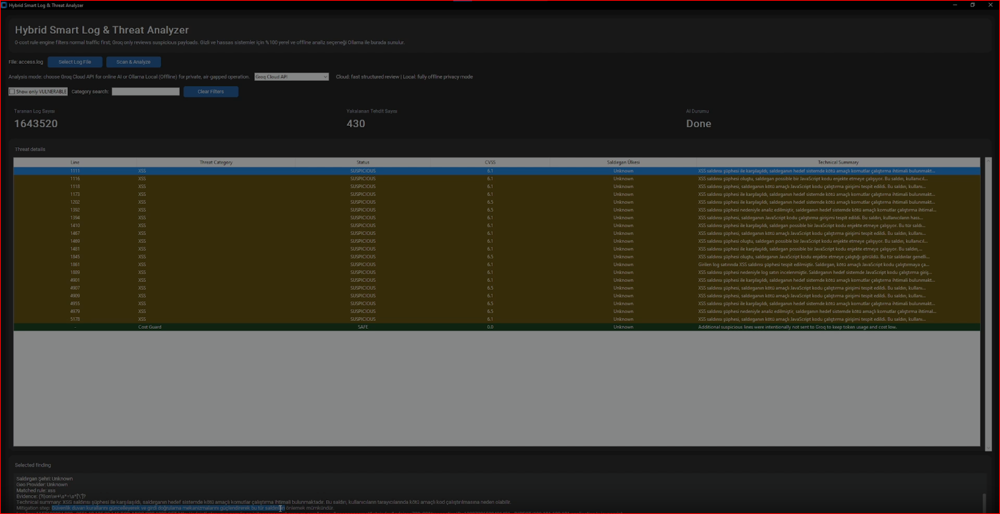
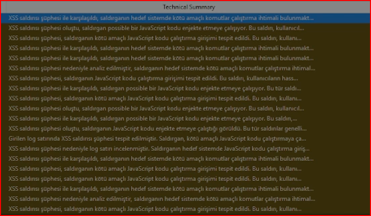

# 🛡️ Hybrid Smart Log & Threat Analyzer

**Hybrid Smart Log & Threat Analyzer** is a high-performance SOC analysis tool designed to process massive log files (1M+ lines) using a hybrid approach: fast rule/signature-based pattern filtering combined with LLM-powered deep threat evaluation (via Groq Cloud API or offline Ollama).


*Figure 1: Main HUD scanning 1.6M+ logs with rule-based detection metrics.*


*Figure 2: LLM-generated technical threat summary and mitigation steps.*

---

## ✨ Key Features

* **⚡ High-Throughput Processing:** Effortlessly parses and scans millions of log lines in seconds using optimized rule-based engines.
* **🧠 Hybrid AI Analysis:** Leverages LLM capabilities (**Groq API** for cloud speed or **Ollama** for 100% offline/air-gapped privacy) to explain complex threats in natural language.
* **💰 Cost Guard Mechanism:** Intelligently filters out normal traffic and routes only high-risk/suspicious lines to the LLM to prevent high API token costs and rate limits.
* **🔍 Structured UI / Dark HUD:** Built with CustomTkinter for a clean, responsive, dark-mode threat monitoring experience.
* **🛡️ Mitigation Guidance:** Generates instant technical summaries and suggested mitigation steps for identified vectors (e.g., XSS, SQLi, Probing).

---

## 🛠️ Architecture Overview

1. **Rule Engine Filter:** Rapidly scans the raw log file (`.log`) and tags suspicious patterns (XSS payloads, probing scripts, etc.).
2. **Cost Guard:** Caps the maximum number of suspicious logs sent to the LLM to optimize quota.
3. **LLM Reasoning:** Sends filtered anomalies to Groq Cloud API or local Ollama to evaluate the actual risk level and produce a human-readable summary.
4. **HUD Dashboard:** Renders interactive threat lists, severity indicators, and selected finding details.

---

## 🚀 Quick Start

### Prerequisites

* Python 3.9 or higher
* Groq API Key (if using Cloud AI mode) or Ollama installed (if using local offline mode)

### Installation

1. **Clone the repository:**
   ```bash
   git clone [https://github.com/alperkilik06/hybrid-log-analyzer.git](https://github.com/alperkilik06/hybrid-log-analyzer.git)
   cd hybrid-log-analyzer
Install dependencies:

Bash
pip install -r requirements.txt
Configure Environment Variables:
Create a .env file in the root directory and add your Groq API key:

Kod snippet'i
GROQ_API_KEY=your_actual_groq_api_key_here
Run the Application:

Bash
python main.py
📊 Sample Dataset
To test the performance with real-world traffic data (~1.6M lines / 215 MB raw log), you can download the public dataset used in our benchmarks:

💾 Dataset Source: SecRepo Squid Access Log

Usage: Extract the .gz file and load the resulting access.log directly into the application via the "Select Log File" button.

🔒 Security & Privacy
No Hardcoded Keys: Secrets are fully managed via environment variables (.env).

Air-Gapped Ready: Switch to Ollama Local (Offline) mode in the dropdown to ensure zero data leaves your local machine.
